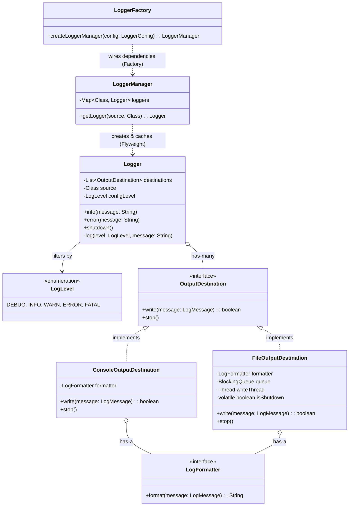

# System Design Masterclass: High-Performance Logger

This document serves as a tutorial and reference guide for Low-Level Design (LLD). It uses a standard "Logger Framework" as the core problem statement, but focuses heavily on the **advanced concepts, concurrency, and design patterns** that interviewers look for in SDE2 / Senior roles.

---

## 1. Problem Statement: Core Requirements
Build a logging framework (similar to Log4j or SLF4J) with the following requirements:
1. Support different logging levels (`DEBUG`, `INFO`, `WARN`, `ERROR`, `FATAL`).
2. Log the timestamp, source class, log level, and the message content.
3. Support multiple output destinations simultaneously (e.g., Console, File, Database).
4. The log level and output destinations should be dynamically configurable.
5. **Must be Thread-Safe** to handle concurrent logging from multiple threads.
6. **Must be highly performant** (logging should not slow down the main application).
7. Extensible to support new log levels and destinations without modifying core code.

---

## 2. Architecture & Class Design

Below is the final architecture demonstrating **SOLID** principles.



---

## 3. Advanced Concepts & The "Why"

In senior interviews, you must justify *why* you chose a specific data structure or pattern over an alternative.

### 3.1 Separation of Concerns: The `LogFormatter`
**The Problem:** Initially, the `Logger` class formatted the string itself (`String.format("%s [%s]...", time, class, msg)`). 
**The "Why":** This violates the **Single Responsibility Principle (SRP)**. If a Database destination requires a JSON format, but a Console destination requires plain text, a single `Logger` formatting logic breaks down.
**The Solution:** We abstract formatting into a `LogFormatter` interface and inject it into the *Destination*, not the Logger. The Logger simply creates a raw `LogMessage` data object and passes it to the destinations. Each destination decides how (and if) it wants to format the data.

### 3.2 Concurrency: The Check-Then-Act Race Condition
**The Problem:** In `LoggerManager`, we cache loggers to avoid creating thousands of identical objects. The naive approach is:
```java
if(!loggers.containsKey(source)) {
    loggers.put(source, new Logger(...));
}
```
**The "Why":** This is a classic "Check-Then-Act" race condition. If two threads check `containsKey` at the exact same millisecond, they both see `false`, and both create and put a new Logger, overwriting each other.
**The Solution:** Use `ConcurrentHashMap` and its atomic `computeIfAbsent` method. This guarantees thread-safety without explicit locking.

### 3.3 Concurrency: Iteration vs Modification (`CopyOnWriteArrayList`)
**The Problem:** `Logger` loops over a `List<OutputDestination>` using a `forEach` loop. If an administrator dynamically adds a new destination while a thread is currently logging, Java will throw a `ConcurrentModificationException`.
**The "Why":** Standard `ArrayList` is not thread-safe. You could use `Collections.synchronizedList()`, but that locks the entire list every time someone logs a message, killing performance. 
**The Solution:** `CopyOnWriteArrayList`. 
*   *Why this collection?* Logging systems have a 99.99% read ratio (iterating over destinations) and a 0.01% write ratio (adding a destination). `CopyOnWriteArrayList` is lock-free for reads. When a write happens, it simply clones the underlying array. It is the perfect data structure for this specific use case.

### 3.4 High-Performance I/O: Producer-Consumer Pattern
**The Problem:** `FileOutputDestination` needs to write to a file. The naive approach opens a `FileWriter`, writes the string, and closes it inside a `synchronized` block. 
**The "Why":** Disk I/O is incredibly slow. If 1,000 threads try to log simultaneously, they will block the main application's business logic waiting for file access. Logging should *never* slow down the main app.
**The Solution:** Asynchronous Logging via the **Producer-Consumer** pattern.
*   **Producer (Main Thread):** Pushes the log into a thread-safe `BlockingQueue` (`LinkedBlockingDeque`) and returns instantly.
*   **Consumer (Background Thread):** A dedicated daemon thread loops infinitely, `poll()`s the queue, and writes to a `BufferedWriter`. 
This decouples the slow I/O operation from the fast application threads.

### 3.5 Thread Management: Graceful Shutdown
**The Problem:** Our background writing thread is caught in a `while(true)` loop. If the application stops, the JVM might hang waiting for this thread to die, or forcefully kill it, causing the loss of logs still sitting in the queue.
**The "Why":** Background workers must be told *when* to stop and given time to clean up.
**The Solution:** The "Poison Pill" or "Stop Flag" pattern.
*   We use a `volatile boolean isShutdown = false` flag (`volatile` ensures all threads instantly see the updated value without caching it).
*   The thread's while loop checks `while(!isShutdown || !queue.isEmpty())`.
*   We expose a `stop()` method that sets the flag to true and crucially calls `thread.join()`. `join()` forces the main thread to wait until the background thread completely drains the queue and dies naturally.

### 3.6 Design Patterns: Factory Pattern for Wiring
**The Problem:** `App.java` (the client) shouldn't be responsible for creating formatters, instantiating destinations, and wiring them into lists. 
**The "Why":** This tightly couples the client to specific implementations (violating Dependency Inversion). If we add a new destination type, we'd have to rewrite `App.java`.
**The Solution:** `LoggerFactory`. The client passes a simple `LoggerConfig` (which could be parsed from JSON/YAML). The Factory encapsulates the complex wiring logic (switch statements, instantiating implementations) and returns a clean, fully-configured `LoggerManager`. The client is completely decoupled from the internals.
