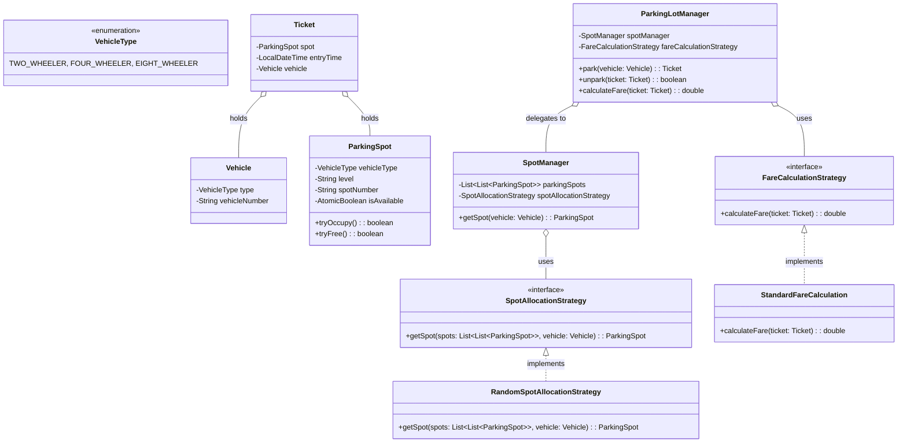

# System Design Masterclass: Parking Lot

This document serves as a tutorial and reference guide for Low-Level Design (LLD). It uses the classic "Parking Lot" problem to demonstrate **advanced concepts, concurrency management, and design patterns** expected in SDE2 / Senior engineering interviews.

---

## 1. Problem Statement: Core Requirements
Build an industry-ready Parking Lot management system with the following capabilities:
1. **Vehicle Types:** Support multiple vehicle sizes (2-wheeler, 4-wheeler, heavy/8-wheeler).
2. **Infrastructure:** Span multiple levels, with multiple entry and exit gates.
3. **Spot Allocation:** Pluggable algorithms to assign spots (e.g., Random vs. Nearest to Entry). Spots have strict compatibility (e.g., Bikes in Bike spots).
4. **Ticketing & Fare:** Generate entry tickets and calculate fares dynamically based on vehicle type, duration, and pricing strategies.
5. **System Constraints (Critical):** Must be highly concurrent and thread-safe. Multiple gates processing vehicles simultaneously must never double-book a spot.

---

## 2. Architecture & Class Design

Below is the architecture demonstrating the **Strategy Pattern** and clean separation of responsibilities.



---

## 3. Advanced Concepts & The "Why"

In a senior interview, implementing the code is only 50% of the battle. You must justify *why* you chose your design.

### 3.1 Design Pattern: The Strategy Pattern (OCP)
**The Problem:** Spot assignment logic (finding a random spot vs finding the spot nearest to Gate A) and Fare Calculation (flat rate vs peak-hour rate) change constantly based on business needs. Hardcoding this into the Managers creates massive, unmaintainable classes.
**The "Why":** We must follow the **Open/Closed Principle (OCP)**. The system must be open for extension but closed for modification. 
**The Solution:** We extracted `SpotAllocationStrategy` and `FareCalculationStrategy` into interfaces. The `ParkingLotManager` doesn't know *how* fare is calculated, it just calls `strategy.calculateFare()`. If the business wants weekend surge pricing tomorrow, we write a new class; we don't touch the core manager.

### 3.2 Data Starvation in Interfaces
**The Problem:** When defining a Strategy interface, it is easy to under-provision it. For example, `ParkingSpot getSpot(Vehicle vehicle)` is useless because the strategy has no data about the physical parking lot.
**The "Why":** Strategies must be injected with, or passed, the context they need to operate. 
**The Solution:** We updated the signature to `getSpot(List<List<ParkingSpot>> parkingSpots, Vehicle vehicle)`. By passing the data structure to the method, the Strategy has all the context it needs to execute its algorithm, while the `SpotManager` retains ownership of the state.

### 3.3 Concurrency: The "Check-Then-Act" Race Condition
**The Problem:** In a multi-gate parking lot, two cars might arrive simultaneously. The naive code looks like this:
```java
if (spot.isAvailable() && spot.getVehicleType() == vehicleType) {
    spot.setAvailable(false); // BUG!
    return spot;
}
```
**The "Why":** This is not atomic. Thread A and Thread B both read `isAvailable() == true`. They both enter the `if` block, both set it to false, and both assign the exact same physical spot to two different cars.

### 3.4 High-Performance Concurrency: Lock-Free Synchronization
**The Solution to Check-Then-Act:**
You could use a `synchronized(spot)` block, but locks are slow and force threads to queue up and wait, hurting the throughput of the parking lot gates.
Instead, we use **Lock-Free Concurrency** via `java.util.concurrent.atomic.AtomicBoolean`.

```java
public class ParkingSpot {
    private AtomicBoolean isAvailable = new AtomicBoolean(true);

    public boolean tryOccupy() {
        return this.isAvailable.compareAndSet(true, false);
    }
}
```
**The "Why":** `compareAndSet` operates at the hardware level. It checks the value and changes it in a single, uninterruptible clock cycle. 
If Thread A and Thread B hit `tryOccupy()` simultaneously:
*   Thread A executes the atomic swap, gets `true`, and claims the spot.
*   Thread B executes the atomic swap a microsecond later, sees the value is no longer `true`, gets `false`, and instantly moves on to check the next spot in the loop.
This allows multiple gates to scan the parking array concurrently at maximum speed without blocking each other.

### 3.5 Domain Exception Handling
**The Problem:** When the lot is full, the strategy returns `null`. Wrapping `null` into a `Ticket` causes downstream `NullPointerExceptions`.
**The "Why":** Applications must fail fast and predictably. 
**The Solution:** We throw an `IllegalStateException` (or preferably, a custom `ParkingLotFullException`). This allows the client (the Gate UI) to catch the specific exception and display a user-friendly "LOT FULL" sign instead of crashing.